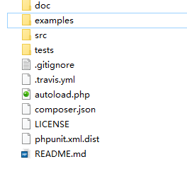

# php集成极光推送JPushphp

------------

### 快速集成JPush
#### 集成jpush的两种方式：
1. [官方文档](https://docs.jiguang.cn/jpush/server/sdk/php_sdk/ "官方文档") 集成SDK
2. [直接下载](https://github.com/jpush/jpush-api-php-client/releases "直接下载")源码包，copy至speedPHP最外层目录

因为我们采用的是speedPHP2版本，因此直接使用下载源码到根目录的方式。目录如下：

examples中有jpush各种产品的使用demo;

在现代的PHP框架中可以直接使用命名空间的方式引入包，在我们的speedphp2版本中使用`require_once 'jpush/autoload.php';`直接的方式引入;

详细使用见代码：
    
        require_once 'jpush/autoload.php';
        $client = new \JPush\Client(appKey, masterSecret);
        try {
            //Android
            $client->push()
            ->setPlatform('all')
            ->addAlias(array($id))
            //                ->addTag(array('guansheng1', 'guansheng2', 'guansheng3')) //别名
            ->androidNotification('推送内容', array(    //多条安卓 send
                'title' => '推送标题',
            ))
            ->send();
            //IOS
            $client->push()
            ->setPlatform('all')
            ->addAlias(array($id))
            //                ->addTag(5)	//标签
            ->iosNotification('推送内容', array(    //多条IOS send
                'title' => '推送标题',
                'badge' => '+1',	//角标，每次+1
            ))
            ->send();
        }catch (Exception $e){
            //错误则 抛出异常
        }

引入AppKey和masterSecret，配合安卓和IOS端进行推送测试即可;

如果觉得麻烦可以先测试简单的demo版本：
    
        require 'jpush/autoload.php';
        $client = new \JPush\Client(appKey, masterSecret);
        
        $client->push()
               ->setPlatform('all')
               ->addAlias('1')
                ->androidNotification('内容'.time().'', array(    //多条安卓发送
                    'title'      => '标题'.time().'',
                    ))

               ->send();

>Tips1：更多方法、使用文档、参数请详见极光推送官方文档;
>
>Tips2：在目录中会生成一个jpush.log文件，记录极光推送的消息、信息体等信息
>
>Tips3：IOS端推送时客户端的SDK参数设置：`jpush/src/JPush/PushPayload.php`中：
>$options['apns_production'] = true;(测试环境) $options['apns_production'] = false;(生产环境)
>**IOS和服务端必须统一，否则接收不到推送消息**